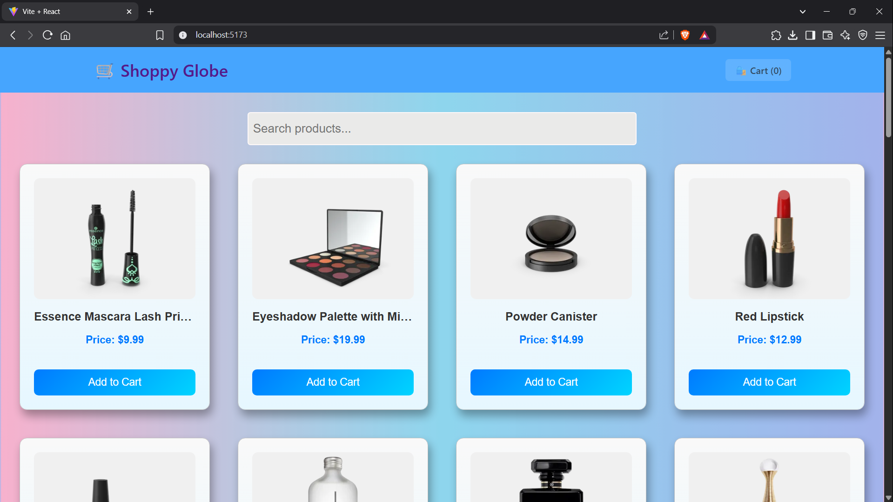
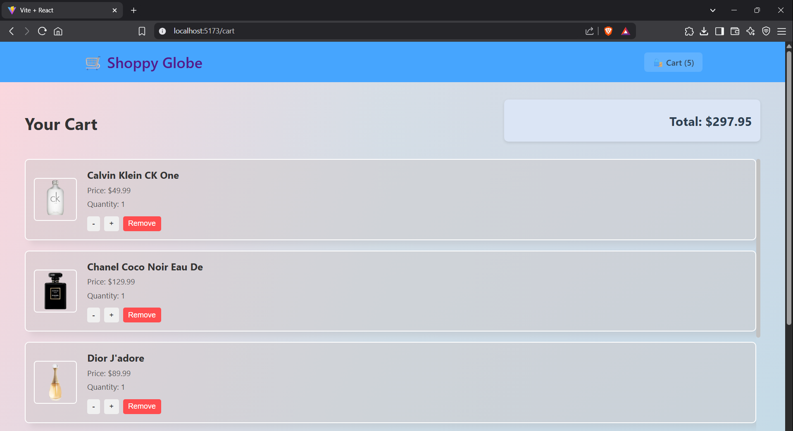

# 🛒 ShoppyGlobe – E-commerce Application

ShoppyGlobe is a basic yet functional e-commerce web application built with **React**, **Redux**, **React Router**, and **Vite**. It allows users to browse products, view product details, manage a shopping cart, and search for items. This project is built as part of a 250-mark full-stack development assignment.

## 📦 Features

- **Product Listing** – Displays all products from an external API.
- **Product Detail Page** – Detailed view of selected product using route parameters.
- **Search Functionality** – Filter products by search input.
- **Cart Management** – Add, remove, and update cart items using Redux.
- **Routing** – Implemented using `react-router-dom`.
- **Error Handling** – Handles failed API requests gracefully.
- **Responsive UI** – Works across devices.
- **Performance Optimization** – Code splitting with `React.lazy` and `Suspense`.

## 🧱 Tech Stack

- **React 19**
- **Redux Toolkit**
- **React Router v7**
- **Vite** (for fast bundling)
- **React Icons**
- **ESLint** (code linting)

## 📁 Folder Structure

```plane text
src/
│
├── components/
│   ├── /Header/Header.jsx
│   ├── /Product/ProductList.jsx
│   ├── /Product/ProductItem.jsx
│   ├── /ProductDetail/ProductDetail.jsx
│   ├── /Cart/Cart.jsx
│   ├── /CartItem/CartItem.jsx
│   └── /NotFound/NotFound.jsx
|   └── /SkeletonLoader/SkeletonLoader.jsx
|   └── /ProductDetailSkeletonLoader/ProductDetailSkeletonLoader.jsx
│
├── redux/
│   ├── store.js
│   └── cartSlice.js
│
├── hooks/
│   └── useFetchProducts.js
│
├── App.jsx
├── main.jsx
└── index.css
```

## Demo

- 
- 

## 🚀 Installation

Follow these steps to setup and run the project locally.

### 1. Clone the Repository

```bash
git clone https://github.com/ankitNegiDev/Shoopy-Globe
cd shoppyglobe
```

### 2. Install Dependencies

```bash
npm install
```

### 3. Run Development Server

```bash
npm run dev
```

The app will be available at: `http://localhost:5173`

## 🌐 API Used

- Product data is fetched from:  
  [https://dummyjson.com/products](https://dummyjson.com/products)

## 📝 License

This project is created as part of a development assignment and is intended for educational use.
